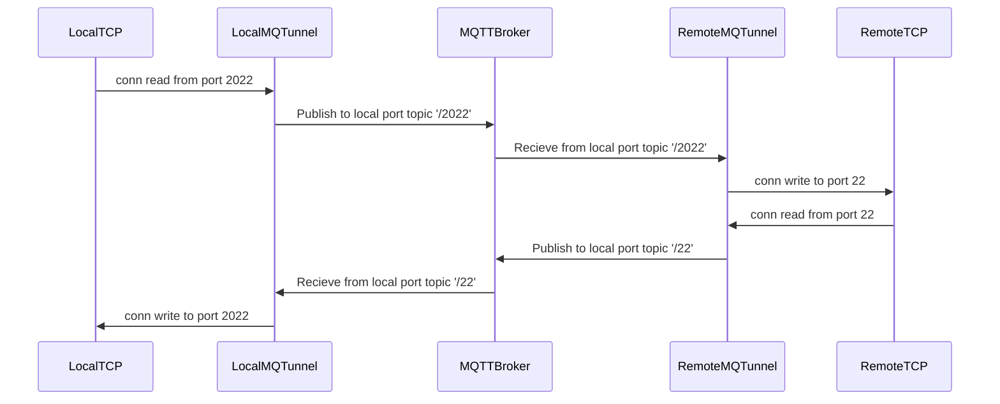
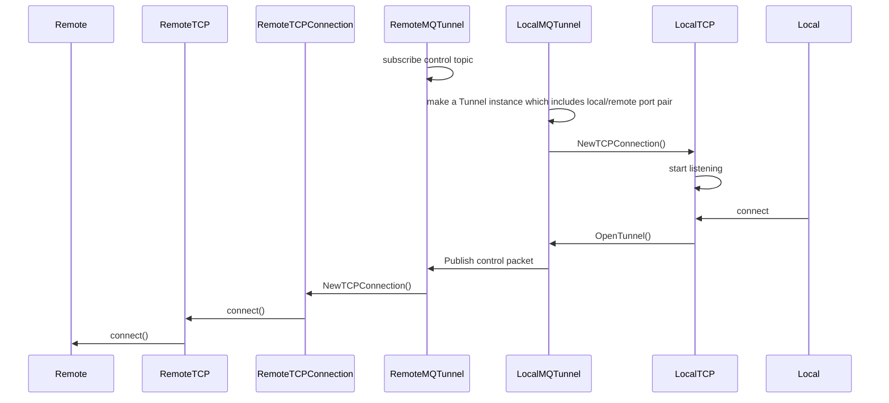

# libmqttunnel: tunnel via MQTT broker

This library tunnels TCP Connection through the MQTT Broker.

Based on https://github.com/shirou/mqtunnel

# How to use


# Config file 

You can use client certs as well as username/password in the Config file.

```
{
    "host": "mqttbroker.example",
    "port": 8883,
	"username", "",
	"password", "",
    "caCert": "certs/root-CA.crt",
    "clientCert": "certs/5a880e326f-certificate.pem.crt",
    "privateKey": "certs/5a880e326f-private.pem.key",
    "control": "device/1/control"
}
```

Other options

- `clientId`: MQTT ClientID. If empty, random string is generated


# Architecture

Example: Local port = 2022, Remote port = 22,



## More internal architecture




# License

- Apache License
